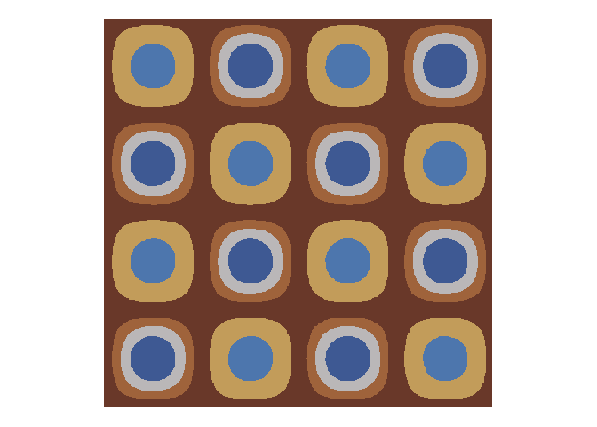
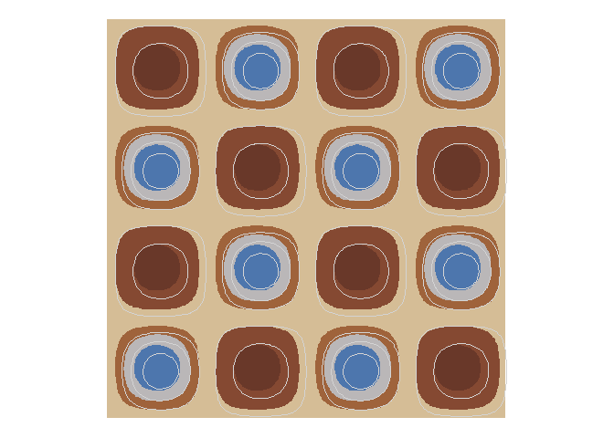
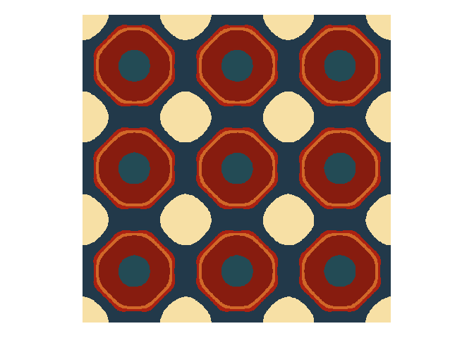
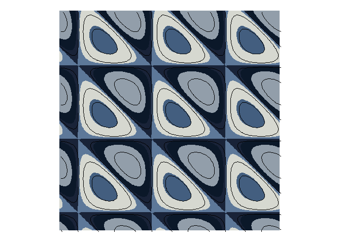
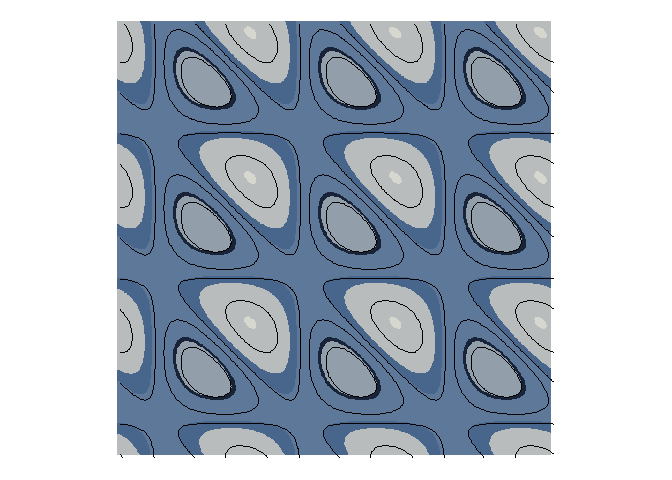
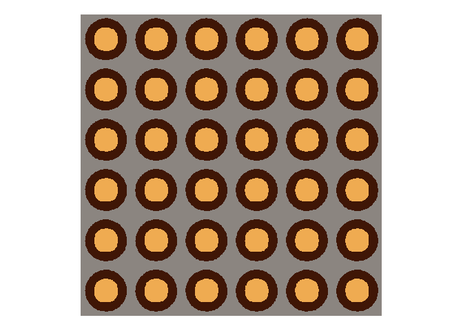
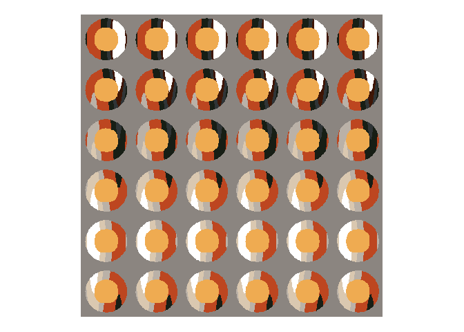

<!-- README.md is generated from README.Rmd. Please edit that file -->

# Elemental Topographies

As I was searching the literature on generative art/math and art for the
Rtistry book project, I came across a paper in the Journal of
Mathematics and the Arts by [Sabina Puc and Riste
Škrekovski](https://doi.org/10.1080/17513472.2011.589276) that discusses
color contour maps. I am familiar with contour maps and use them in my
[Mapstodon series](https://github.com/paezha/Mapstodon). I started my
professional life as a land surveyor in my last year of university and
the year before going to graduate school, so contour lines are a concept
that has been with me for a long time.

Further, I have passing familiarity with parametric functions. They are
sometimes used to illustrate the pitfalls of optimization algorithms and
how genetic algorithms can successfully “jump out” of local minima by
randomly exploring the solution space.

The paper on color contour maps did not really have a lot of new
information for me. What it brought was a flash of insight. I have been
working on a couple of projects that use [Tyler Morgan
Wall’s](https://github.com/tylermorganwall)
[{rayrender}](https://www.rayrender.net/index.html), the `R` package for
raytracing 3D scenes. One of these systems,
[pilares](https://github.com/paezha/Pilares), got me thinking about how
much of art is perspective, that is, the position from where we see
things. The contour maps made me think of something related: that in
addition to perspective, it also matters what we *choose* to see.

Briefly, a contour line is a line that connects points on a plane with
equal values. Contour maps can be used to represent in two dimensions
any data set with $(x, y, z)$ coordinates.

In topographical maps, this means equal elevation, so the contours are a
representation of the relief of the landscape. The coordinates $(x, y)$
are position in space, and $z$ is the elevation. The idea is fairly
general. [Isochrones](https://en.wikipedia.org/wiki/Isochrone_map) are
contour maps that connect all points of equal *travel time* from an
origin. [Isobaths](https://en.wikipedia.org/wiki/Bathymetry) are contour
lines the represent equal *depth*. In meteorology, isotherms are contour
lines of equal temperature, in electrostatics isopotential are contour
lines of constant electric potential. And so on.

In practice, contour lines are usually interpolated from (usually
scarce) observations of some phenomenon. Isocontours are then a form of
interpolation, like filling the gaps in our knowledge of the surface of
interest. But suppose that we had full knowledge of the surface to begin
with. In this case, we can choose which isocontour lines to see.

So there are (maybe) three parts to playing with color contour maps.

1.  Choosing an interesting surface.
2.  Choosing what to see of that surface.
3.  Choosing how to see what we choose to see.

## Interesting surfaces

Almost anything will do. Puc and Škrekovski discuss combinations of
trigonometric and power functions, including:

- $\sin^px + \sin^qy$
- $\sin^p(x + y) - \cos^q(x - y)$
- $(\sin^px-\sin^py)(\sin^qx + \cos^qy)$

Trigonometric functions have the lovely property of being *periodic*,
that is, that the patterns repeat themselves over periods. But we can
also use non-periodic functions, including polynomial expansions of
$(x, y)$:

- $x^2 + x + xy + y + y^3$

## Choosing what to see

This amounts to selecting planes parallel to the plane to *cut* the
surface of interest. Obviously, the point at $z$ where these cuts are
made must lie in the range of the function (otherwise we would be
slicing through empty space). Other than that, there is plenty of
latitude to choose the cut points, and in fact this choice is, for me,
one of the most interesting parts of this exercise.

## Choosing how to see what we choose to see

The contours (the set of points where the cut plane slices the surface)
can be represented as lines or as filled contours. This choice, as well
as the colors to use, also grants lots of playful opportunities to
obtain aesthetically pleasing results.

## Preliminaries

Load the packages used in this notebook:

``` r
library(dplyr) # A Grammar of Data Manipulation
library(ggplot2) # Create Elegant Data Visualisations Using the Grammar of Graphics
library(glue) # Interpreted String Literals
library(here) # A Simpler Way to Find Your Files
library(MetBrewer) # Color Palettes Inspired by Works at the Metropolitan Museum of Art
library(metR) # For contouring 
#> Warning: package 'metR' was built under R version 4.2.2
library(MexBrewer) # Color Palettes Inspired by Works of Mexican Muralists
```

## Simple non-periodic function

I begin by illustrating the use of a non-periodic function, with a map
that uses a polynomial expansion of the coordinates $(x, y)$: $$
z = x + y
$$ The domain for this is $D = {(x,y);-1\le x \le1,-1\le y \le1}$.

I begin by creating a data frame with the grid for calculating the
function:

``` r
df <- expand.grid(x = seq(-1, 1, 0.05),
                  y = seq(-1, 1, 0.05)) |>
  mutate(x = x,
         y = y,
         z = x + y)
```

The range of the function in the interval of the domain is $[-2, 2]$:

``` r
min(df$z)
#> [1] -2
max(df$z)
#> [1] 2
```

I choose to slice the surface at
$z_c=[-1.75, -1, -0.25, 0.5, 0.75, 1.5]$. Contours (lines and filled
contours) are implemented in package [`ggplot2`](). I choose color
palette Hiroshige from Blake R. Mills’
[`metBrewer`](https://github.com/BlakeRMills/MetBrewer) package:

``` r
cols <- met.brewer("Hiroshige", n = 11)

min_z = min(df$z)
max_z = max(df$z)

ggplot(data = df) +
  geom_contour_filled(aes(x = x, y = y, z = z),
                      alpha = 1,
                      breaks = c(min_z, -1.75, -1, -0.25, 0.5, 0.75, 1.5, max_z)) +
  scale_fill_manual(values = sample(cols, 11)) +
  coord_equal() +
  theme_void()  +
  theme(legend.position = "none")
```

<!-- -->

## Periodic functions

The procedure above (choosing a surface, what to see, how to see it) is
repeated next using a few periodic functions.

The following is the function used to create Figure 3 in Puc and
Skrekovski: $$
z = \sin x \cdot \sin y
$$

Create a grid and calculate the function in the domain
$D = {(x,y);-2\pi\le x \le 2\pi,-2\pi\le y \le 2\pi}$:

``` r
df <- expand.grid(x = seq(-2 * pi, 2 * pi, 0.1),
                  y = seq(-2 * pi, 2 * pi, 0.1)) |>
  mutate(x = x,
         y = y,
         z = sin(x) * sin(y))
```

For this next plot I use palette “Alacena” from my package
[`mexBrewer`](https://paezha.github.io/MexBrewer/) and cut points to
slice the surface at $z_c=[-0.75, -0.25, 0.25, 0.5, 0.75]$.:

``` r
cols <- mex.brewer("Alacena", n = 11)

min_z = min(df$z)
max_z = max(df$z)

ggplot(data = df) +
  geom_contour_filled(aes(x = x, y = y, z = z),
                      breaks = c(min_z, -0.75, -0.25, 0.25, 0.5, 0.75, max_z)) +
  scale_fill_manual(values = sample(cols, 6)) +
  coord_equal() +
  theme_void()  +
  theme(legend.position = "none")
```

<!-- -->

<!--
Minimal tootable version:

library(dplyr)
library(ggplot2)

df<-expand.grid(x = seq(-2*pi,2*pi,0.1),y=seq(-2*pi,2*pi,0.1)) |>
mutate(z=sin(x)*sin(y))

ggplot(data = df) +
geom_contour_filled(aes(x,y,z=z),
breaks = c(-Inf,-0.75,-0.25,0.25,0.5,0.75,Inf)) +
coord_equal()+theme_void()+theme(legend.position="none")
-->

Still using the same surface, breaks, and color palette, notice the
playful effect achieved by overlaying a set of contour lines that have
been shifted a small distance on the plane:

``` r
ggplot(data = df) +
  geom_contour_filled(aes(x = x, y = y, z = z),
                      breaks = c(min_z, -0.75, -0.25, 0.25, 0.5, 0.75, max_z)) +
  geom_contour(aes(x = x + 0.10,
                   y = y - 0.10,
                   z = z),
               breaks = 0.1 + c(-0.75, -0.25, 0.25, 0.5, 0.75),
               color = "lightgray") +
  scale_fill_manual(values = sample(cols, 6)) +
  coord_equal() +
  theme_void()  +
  theme(legend.position = "none")
```

<!-- -->

A variation on the theme uses this equation (compare to Figure 3 in Puc
and Skrekovski): $$
z = f(x, y) = \sin x - \sin^3 x \cdot\sin^3 y + \sin y
$$

Create a data frame with points in the domain
$D = {(x,y);-3.5\pi\le x \le 2.5\pi,-3.5\pi\le y \le 2.5\pi}$ and then
calculate $z$:

``` r
df <- expand.grid(x = seq(-3.5 * pi, 2.5 * pi, 0.1),
                  y = seq(-3.5 * pi, 2.5 * pi, 0.1)) |>
  mutate(x = x,
         y = y,
         z = sin(x) - sin(x)^3 * sin(y)^3 + sin(y))
```

For this colored contour map I use palette “Revolucion” from MexBrewer,
and cut points $z_c=[-1.75, -0.25, 0, 0.25, 1.0]$:

``` r
cols <- mex.brewer("Revolucion", n = 11)

min_z = min(df$z)
max_z = max(df$z)

ggplot(data = df) +
  geom_contour_filled(aes(x = x, y = y, z = z),
                      alpha = 1,
                      breaks = c(min_z, -1.75, -0.25, 0, 0.25, 1, max_z)) +
  scale_fill_manual(values = sample(cols, 11)) +
  coord_equal() +
  theme_void() +
  theme(legend.position = "none")
```

<!-- -->

Overlaying a second set of contours adds to the playfulness of the map:

``` r
ggplot(data = df) +
  geom_contour_filled(aes(x = x, y = y, z = z),
                      breaks = c(min_z, -1.75, -0.25, 0, 0.25, 1, max_z)) +
  geom_contour(aes(x = x + 0.10,
                   y = y - 0.10,
                   z = z),
               breaks = 0.1 + c(-1.15, -0.55, 0.0, max_z),
               color = "lightgray") +
  scale_fill_manual(values = sample(cols, 11)) +
  coord_equal() +
  theme_void() +
  theme(legend.position = "none")
```

<!-- -->

Figure 5e in Puc and Skrekovski uses the following function: $$
z = f(x,y) = \sin x + \sin(x + y) + \sin(y)
$$

This function is calculated for a grid in the domain
$D = {(x,y);-3.5\pi\le x \le 2.5\pi,-3.5\pi\le y \le 2.5\pi}$ here:

``` r
df <- expand.grid(x = seq(-3.5 * pi, 2.5 * pi, 0.1),
                  y = seq(-3.5 * pi, 2.5 * pi, 0.1)) |>
  mutate(x = x,
         y = y,
         z = sin(x) + sin(x + y) + sin(y))
```

The color map draws from a monotone palette in MexBrewer (i.e.,
“Frida”). I like how the contours form almost perfect triangles and
squares:

``` r
cols <- mex.brewer("Frida", n = 11)

min_z = min(df$z)
max_z = max(df$z)

ggplot(data = df) +
  geom_contour_filled(aes(x = x, y = y, z = z),
                      alpha = 1,
                      breaks = c(min_z, -1.75, -0.25, 0, 0.25, 1, max_z)) +
  geom_contour(aes(x = x + 0.10,
                   y = y - 0.10, 
                   z = z),
               breaks = 0.1 + c(-2.0, -0.75, 0.0, 1.75),
               color = "black") +
  scale_fill_manual(values = sample(cols, 11)) +
  coord_equal() +
  theme_void() +
  theme(legend.position = "none")
```

<!-- -->

While similar, the contour map is a lot less angular when we choose to
see a different set of contours. The character of the map certainly
seems to change:

``` r
ggplot(data = df) +
  geom_contour_filled(aes(x = x, y = y, z = z),
                      alpha = 1,
                      breaks = c(min_z, -1.75, -1.55, 0.15, 0.75, 2.55, max_z)) +
  geom_contour(aes(x = x + 0.10,
                   y = y - 0.10, 
                   z = z),
               breaks = 0.1 + c(-2.0, -0.75, 0.0, 1.75),
               color = "black") +
  scale_fill_manual(values = sample(cols, 11)) +
  coord_equal() +
  theme_void() +
  theme(legend.position = "none")
```

<!-- -->

The last example here shows how to overlay the contours of two different
surfaces. With some judicious use of transparency, this can create some
interesting effects (see Figure 13 in Puc and Skrekovski). The two
surfaces are: $$
\begin{array}{l}
z_1 = f(x,y) = \sin(2x) + \sin^3(2x) + \sin(\frac{y}{4}) + \sin^3(\frac{y}{4})\\
z_2 = g(x,y) = \sin^2(x) + \sin^4(x) + \sin^6(x) + \sin^2(y) + \sin^4(y) + \sin^6(4)
\end{array}
$$

Two data frames store the grid points in
$D = {(x,y);-3.5\pi\le x \le 2.5\pi,-3.5\pi\le y \le 2.5\pi}$, as well
as the values of $z_1$ and $z_2$:

``` r
df_1 <- expand.grid(x = seq(-3.5 * pi, 2.5 * pi, 0.1),
                    y = seq(-3.5 * pi, 2.5 * pi, 0.1)) |>
  mutate(x = x,
         y = y,
         z = sin(2 * x) + sin(2 * x)^3 + sin(y/4) + sin(y/4)^3)

df_2 <- expand.grid(x = seq(-3.5 * pi, 2.5 * pi, 0.1),
                    y = seq(-3.5 * pi, 2.5 * pi, 0.1)) |>
  mutate(x = x,
         y = y,
         z = sin(x)^2 + sin(x)^4 + sin(x)^6 + sin(y)^2 + sin(y)^4 + sin(y)^6)
```

Let us first explore the first surface. The contours are elongated in
the direction of the $y$ coordinates due to the the division of $y$ by
four in the argument of the trigonometric functions; this division makes
the “waves” longer:

``` r
cols <- mex.brewer("Atentado", n = 11)

min_z1 = min(df_1$z)
max_z1 = max(df_1$z)

ggplot() +
  geom_contour_filled(data = df_1,
                      aes(x = x, 
                          y = y, 
                          z = z),
                      breaks = c(min_z, -3, -2, -1, 1, 2 , 3, max_z)) +
  scale_fill_manual(values = sample(cols, 11)) +
  coord_equal() +
  theme_void() +
  theme(legend.position = "none")
```

<!-- -->

Now let us check the second surface:

``` r
min_z2 = min(df_2$z)
max_z2 = max(df_2$z)

ggplot() +
  geom_contour_filled(data = df_2,
                      aes(x = x, 
                          y = y, 
                          z = z),
                      breaks = c(min_z, 0.75, 3, 6, max_z)) +
  scale_fill_manual(values = sample(cols, 11)) +
  coord_equal() +
  theme_void() +
  theme(legend.position = "none")
```

<!-- -->

In this next figure, the contours of $z_2$ are overlaid on top of the
contours of $z_1$. Parameer `alpha` controls the transparency of the
filled contours; setting it to zero makes the contour transparent, while
setting it to one makes it completely opaque. Interestingly, the second
set of contours with controlled transparency also determines what we
choose to see of the first surface:

``` r
ggplot() +
  geom_contour_filled(data = df_1,
                      aes(x = x, 
                          y = y, 
                          z = z),
                      breaks = c(min_z, -3, -2, -1, 1, 2 , 3, max_z)) +
  geom_contour_filled(data = df_2,
                      aes(x = x, 
                          y = y, 
                          z = z,
                          alpha = factor(after_stat(level))),
                      breaks = c(min_z, 0.75, 3, 6, max_z)) +
  scale_fill_manual(values = sample(cols, 11)) +
  scale_alpha_manual(values = c(1, 0, 1, 1)) +
  coord_equal() +
  theme_void() +
  theme(legend.position = "none")
```

<!-- -->
