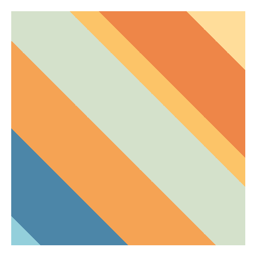
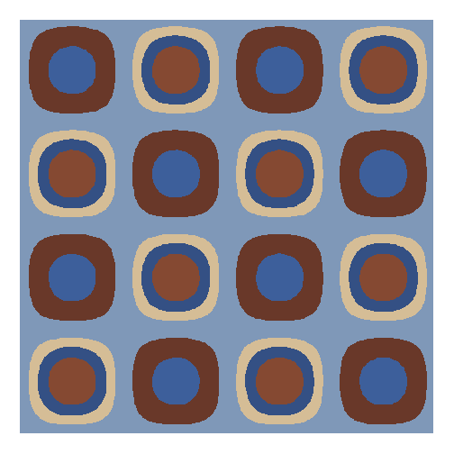
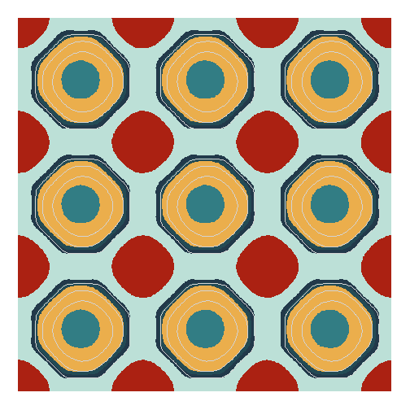
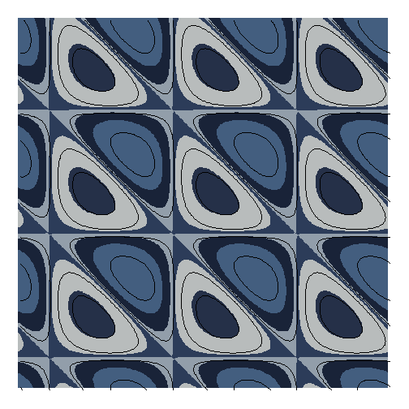
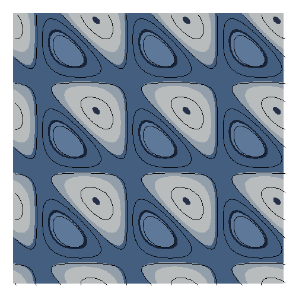
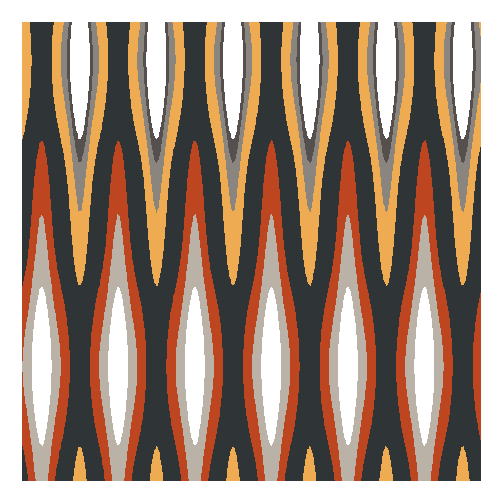

# Elemental Topographies

As I was searching the literature on generative art/math and art for the Rtistry book project, I came across a paper in the Journal of Mathematics and the Arts by [Sabina Puc and Riste Škrekovski](https://doi.org/10.1080/17513472.2011.589276) that discusses color contour maps. I am familiar with contour maps and use them in my [Mapstodon series](https://github.com/paezha/Mapstodon). I started my professional life as a land surveyor in my last year of university and the year before going to graduate school, so contour lines are a concept that has been with me for a long time.

Further, I have passing familiarity with parametric functions. They are sometimes used to illustrate the pitfalls of optimization algorithms and how genetic algorithms can successfully "jump out" of local minima by randomly exploring the solution space.

The paper on color contour maps did not really have a lot of new information for me. What it brought was a flash of insight. I have been working on a couple of projects that use [Tyler Morgan Wall's](https://github.com/tylermorganwall) [{rayrender}](https://www.rayrender.net/index.html), the `R` package for raytracing 3D scenes. One of these systems, [pilares](https://github.com/paezha/Pilares), got me thinking about how much of art is perspective, that is, the position from where we see things. The contour maps made me think of something related: that in addition to perspective, it also matters what we _choose_ to see.

Briefly, a contour line is a line that connects points on a plane with equal values. Contour maps can be used to represent in two dimensions any data set with $(x, y, z)$ coordinates.

In topographical maps, this means equal elevation, so the contours are a representation of the relief of the landscape. The coordinates $(x, y)$ are position in space, and $z$ is the elevation. The idea is fairly general. [Isochrones](https://en.wikipedia.org/wiki/Isochrone_map) are contour maps that connect all points of equal _travel time_ from an origin. [Isobaths](https://en.wikipedia.org/wiki/Bathymetry) are contour lines the represent equal _depth_. In meteorology, isotherms are contour lines of equal temperature, in electrostatics isopotential are contour lines of constant electric potential. And so on.

In practice, contour lines are usually interpolated from (usually scarce) observations of some phenomenon. Isocontours are then a form of interpolation, like filling the gaps in our knowledge of the surface of interest. But suppose that we had full knowledge of the surface to begin with. In this case, we can choose which isocontour lines to see. 

So there are (maybe) three parts to playing with color contour maps.

1. Choosing an interesting surface.
2. Choosing what to see of that surface.
3. Choosing how to see what we choose to see.

## Interesting surfaces

Almost anything will do. Puc and Škrekovski discuss combinations of trigonometric and power functions, including:

- $\sin^px + \sin^qy$
- $\sin^p(x + y) - \cos^q(x - y)$
- $(\sin^px-\sin^py)(\sin^qx + \cos^qy)$

Trigonometric functions have the lovely property of being _periodic_, that is, that the patterns repeat themselves over periods. But we can also use non-periodic functions, including polynomial expansions of $(x, y)$:

- $x^2 + x + xy + y + y^3$

## Choosing what to see

This amounts to selecting planes parallel to the plane to _cut_ the surface of interest. Obviously, the point at $z$ where these cuts are made must lie in the range of the function (otherwise we would be slicing through empty space). Other than that, there is plenty of latitude to choose the cut points, and in fact this choice is, for me, one of the most interesting parts of this exercise.

## Choosing how to see what we choose to see

The contours (the set of points where the cut plane slices the surface) can be represented as lines or as filled contours. This choice, as well as the colors to use, also grants lots of playful opportunities to obtain aesthetically pleasing results.

## Preliminaries

Load the packages used in this notebook:

```r
library(dplyr) # A Grammar of Data Manipulation
library(ggplot2) # Create Elegant Data Visualisations Using the Grammar of Graphics
library(glue) # Interpreted String Literals
library(here) # A Simpler Way to Find Your Files
library(MetBrewer) # Color Palettes Inspired by Works at the Metropolitan Museum of Art
library(metR) # For contouring 
library(MexBrewer) # Color Palettes Inspired by Works of Mexican Muralists
```

## Simple non-periodic function

I begin by illustrating the use of a non-periodic function, with a map that uses a polynomial expansion of the coordinates $(x, y)$:
$$
z = x + y
$$
The domain for this is $D = {(x,y);-1\le x \le1,-1\le y \le1}$.

I begin by creating a data frame with the grid for calculating the function:

```r
df <- expand.grid(x = seq(-1, 1, 0.05),
                  y = seq(-1, 1, 0.05)) |>
  mutate(x = x,
         y = y,
         z = x + y)
```

The range of the function in the interval of the domain is $[-2, 2]$:

```r
min(df$z)
#> [1] -2
max(df$z)
#> [1] 2
```

I choose to slice the surface at $z_c=[-1.75, -1, -0.25, 0.5, 0.75, 1.5]$. Contours (lines and filled contours) are implemented in package [`ggplot2`](). I choose color palette Hiroshige from Blake R. Mills' [`metBrewer`](https://github.com/BlakeRMills/MetBrewer) package:

```r
cols <- met.brewer("Hiroshige", n = 11)

min_z = min(df$z)
max_z = max(df$z)

ggplot(data = df) +
  geom_contour_filled(aes(x = x, y = y, z = z),
                      alpha = 1,
                      breaks = c(min_z, -1.75, -1, -0.25, 0.5, 0.75, 1.5, max_z)) +
  scale_fill_manual(values = sample(cols, 11)) +
  coord_equal() +
  theme_void()  +
  theme(legend.position = "none")
```



## Periodic functions

The procedure above (choosing a surface, what to see, how to see it) is repeated next using a few periodic functions.

The following is the function used to create Figure 3 in Puc and Skrekovski:
$$
z = \sin x \cdot \sin y
$$

Create a grid and calculate the function in the domain $D = {(x,y);-2\pi\le x \le 2\pi,-2\pi\le y \le 2\pi}$:

```r
df <- expand.grid(x = seq(-2 * pi, 2 * pi, 0.1),
                  y = seq(-2 * pi, 2 * pi, 0.1)) |>
  mutate(x = x,
         y = y,
         z = sin(x) * sin(y))
```

For this next plot I use palette "Alacena" from my package [`mexBrewer`](https://paezha.github.io/MexBrewer/) and cut points to slice the surface at $z_c=[-0.75, -0.25, 0.25, 0.5, 0.75]$.:

```r
cols <- mex.brewer("Alacena", n = 11)

min_z = min(df$z)
max_z = max(df$z)

ggplot(data = df) +
  geom_contour_filled(aes(x = x, y = y, z = z),
                      breaks = c(min_z, -0.75, -0.25, 0.25, 0.5, 0.75, max_z)) +
  scale_fill_manual(values = sample(cols, 6)) +
  coord_equal() +
  theme_void()  +
  theme(legend.position = "none")
```



<!--
Minimal tootable version:

library(dplyr)
library(ggplot2)

df<-expand.grid(x = seq(-2*pi,2*pi,0.1),y=seq(-2*pi,2*pi,0.1)) |>
mutate(z=sin(x)*sin(y))

ggplot(data = df) +
geom_contour_filled(aes(x,y,z=z),
breaks = c(-Inf,-0.75,-0.25,0.25,0.5,0.75,Inf)) +
coord_equal()+theme_void()+theme(legend.position="none")

ggsave("tootable-sample.png", height = 5, width = 5)
-->

Still using the same surface, breaks, and color palette, notice the playful effect achieved by overlaying a set of contour lines that have been shifted a small distance on the plane:

```r
ggplot(data = df) +
  geom_contour_filled(aes(x = x, y = y, z = z),
                      breaks = c(min_z, -0.75, -0.25, 0.25, 0.5, 0.75, max_z)) +
  geom_contour(aes(x = x + 0.10,
                   y = y - 0.10,
                   z = z),
               breaks = 0.1 + c(-0.75, -0.25, 0.25, 0.5, 0.75),
               color = "lightgray") +
  scale_fill_manual(values = sample(cols, 6)) +
  coord_equal() +
  theme_void()  +
  theme(legend.position = "none")
```


A variation on the theme uses this equation (compare to Figure 3 in Puc and Skrekovski):
$$
z = f(x, y) = \sin x - \sin^3 x \cdot\sin^3 y + \sin y
$$

Create a data frame with points in the domain $D = {(x,y);-3.5\pi\le x \le 2.5\pi,-3.5\pi\le y \le 2.5\pi}$ and then calculate $z$:

```r
df <- expand.grid(x = seq(-3.5 * pi, 2.5 * pi, 0.1),
                  y = seq(-3.5 * pi, 2.5 * pi, 0.1)) |>
  mutate(x = x,
         y = y,
         z = sin(x) - sin(x)^3 * sin(y)^3 + sin(y))
```

For this colored contour map I use palette "Revolucion" from MexBrewer, and cut points $z_c=[-1.75, -0.25, 0, 0.25, 1.0]$:

```r
cols <- mex.brewer("Revolucion", n = 11)

min_z = min(df$z)
max_z = max(df$z)

ggplot(data = df) +
  geom_contour_filled(aes(x = x, y = y, z = z),
                      alpha = 1,
                      breaks = c(min_z, -1.75, -0.25, 0, 0.25, 1, max_z)) +
  scale_fill_manual(values = sample(cols, 11)) +
  coord_equal() +
  theme_void() +
  theme(legend.position = "none")
```


Overlaying a second set of contours adds to the playfulness of the map:

```r
ggplot(data = df) +
  geom_contour_filled(aes(x = x, y = y, z = z),
                      breaks = c(min_z, -1.75, -0.25, 0, 0.25, 1, max_z)) +
  geom_contour(aes(x = x + 0.10,
                   y = y - 0.10,
                   z = z),
               breaks = 0.1 + c(-1.15, -0.55, 0.0, max_z),
               color = "lightgray") +
  scale_fill_manual(values = sample(cols, 11)) +
  coord_equal() +
  theme_void() +
  theme(legend.position = "none")
```



<!--
Minimal tootable version:

library(dplyr)
library(ggplot2)
ggplot(data=expand.grid(x=seq(-3.5*pi,2.5*pi,0.1),y=seq(-3.5*pi,2.5*pi,0.1)) |> mutate(z=-sin(x)+sin(x)^3*sin(y)^3-sin(y)))+
geom_contour_filled(aes(x,y,z=z),breaks=c(-1.75,-0.25,0,0.25,1,Inf))+
geom_contour(aes(x=x+0.10,y=y-0.10,z=z),breaks = c(-1.25,-0.65,0.1),color="white")+
scale_fill_viridis_d(option="B")+coord_equal()+theme_void()+theme(legend.position="none")

ggsave("tootable-sample-3.png", height = 5, width = 5)
-->

Figure 5e in Puc and Skrekovski uses the following function:
$$
z = f(x,y) = \sin x + \sin(x + y) + \sin(y)
$$

This function is calculated for a grid in the domain $D = {(x,y);-3.5\pi\le x \le 2.5\pi,-3.5\pi\le y \le 2.5\pi}$ here:

```r
df <- expand.grid(x = seq(-3.5 * pi, 2.5 * pi, 0.1),
                  y = seq(-3.5 * pi, 2.5 * pi, 0.1)) |>
  mutate(x = x,
         y = y,
         z = sin(x) + sin(x + y) + sin(y))
```

The color map draws from a monotone palette in MexBrewer (i.e., "Frida"). I like how the contours form almost perfect triangles and squares:

```r
cols <- mex.brewer("Frida", n = 11)

min_z = min(df$z)
max_z = max(df$z)

ggplot(data = df) +
  geom_contour_filled(aes(x = x, y = y, z = z),
                      alpha = 1,
                      breaks = c(min_z, -1.75, -0.25, 0, 0.25, 1, max_z)) +
  geom_contour(aes(x = x + 0.10,
                   y = y - 0.10, 
                   z = z),
               breaks = 0.1 + c(-2.0, -0.75, 0.0, 1.75),
               color = "black") +
  scale_fill_manual(values = sample(cols, 11)) +
  coord_equal() +
  theme_void() +
  theme(legend.position = "none")
```



While similar, the contour map is a lot less angular when we choose to see a different set of contours. The character of the map certainly seems to change:

```r
ggplot(data = df) +
  geom_contour_filled(aes(x = x, y = y, z = z),
                      alpha = 1,
                      breaks = c(min_z, -1.75, -1.55, 0.15, 0.75, 2.55, max_z)) +
  geom_contour(aes(x = x + 0.10,
                   y = y - 0.10, 
                   z = z),
               breaks = 0.1 + c(-2.0, -0.75, 0.0, 1.75),
               color = "black") +
  scale_fill_manual(values = sample(cols, 11)) +
  coord_equal() +
  theme_void() +
  theme(legend.position = "none")
```



The last example here shows how to overlay the contours of two different surfaces. With some judicious use of transparency, this can create some interesting effects (see Figure 13 in Puc and Skrekovski). The two surfaces are:
$$
\begin{array}{l}
z_1 = f(x,y) = \sin(2x) + \sin^3(2x) + \sin(\frac{y}{4}) + \sin^3(\frac{y}{4})\\
z_2 = g(x,y) = \sin^2(x) + \sin^4(x) + \sin^6(x) + \sin^2(y) + \sin^4(y) + \sin^6(4)
\end{array}
$$

Two data frames store the grid points in $D = {(x,y);-3.5\pi\le x \le 2.5\pi,-3.5\pi\le y \le 2.5\pi}$, as well as the values of $z_1$ and $z_2$:

```r
df_1 <- expand.grid(x = seq(-3.5 * pi, 2.5 * pi, 0.1),
                    y = seq(-3.5 * pi, 2.5 * pi, 0.1)) |>
  mutate(x = x,
         y = y,
         z = sin(2 * x) + sin(2 * x)^3 + sin(y/4) + sin(y/4)^3)

df_2 <- expand.grid(x = seq(-3.5 * pi, 2.5 * pi, 0.1),
                    y = seq(-3.5 * pi, 2.5 * pi, 0.1)) |>
  mutate(x = x,
         y = y,
         z = sin(x)^2 + sin(x)^4 + sin(x)^6 + sin(y)^2 + sin(y)^4 + sin(y)^6)
```

Let us first explore the first surface. The contours are elongated in the direction of the $y$ coordinates due to the the division of $y$ by four in the argument of the trigonometric functions; this division makes the "waves" longer:

```r
cols <- mex.brewer("Atentado", n = 11)

min_z1 = min(df_1$z)
max_z1 = max(df_1$z)

ggplot() +
  geom_contour_filled(data = df_1,
                      aes(x = x, 
                          y = y, 
                          z = z),
                      breaks = c(min_z, -3, -2, -1, 1, 2 , 3, max_z)) +
  scale_fill_manual(values = sample(cols, 11)) +
  coord_equal() +
  theme_void() +
  theme(legend.position = "none")
```



Now let us check the second surface:

```r
min_z2 = min(df_2$z)
max_z2 = max(df_2$z)

ggplot() +
  geom_contour_filled(data = df_2,
                      aes(x = x, 
                          y = y, 
                          z = z),
                      breaks = c(min_z, 0.75, 3, 6, max_z)) +
  scale_fill_manual(values = sample(cols, 11)) +
  coord_equal() +
  theme_void() +
  theme(legend.position = "none")
```


In this next figure, the contours of $z_2$ are overlaid on top of the contours of $z_1$. Parameer `alpha` controls the transparency of the filled contours; setting it to zero makes the contour transparent, while setting it to one makes it completely opaque. Interestingly, the second set of contours with controlled transparency also determines what we choose to see of the first surface: 

```r
ggplot() +
  geom_contour_filled(data = df_1,
                      aes(x = x, 
                          y = y, 
                          z = z),
                      breaks = c(min_z, -3, -2, -1, 1, 2 , 3, max_z)) +
  geom_contour_filled(data = df_2,
                      aes(x = x, 
                          y = y, 
                          z = z,
                          alpha = factor(after_stat(level))),
                      breaks = c(min_z, 0.75, 3, 6, max_z)) +
  scale_fill_manual(values = sample(cols, 11)) +
  scale_alpha_manual(values = c(1, 0, 1, 1)) +
  coord_equal() +
  theme_void() +
  theme(legend.position = "none")
```


## Some experiments

The preceding maps incorporate only one element of randomness, the colors assigned to the filled contours. Here I modify the system (similar to Figure 5e in Puc and Skrekovski) to increase the range of emergent outcome. To do this, I will add randomness to features of the equation that generates the surface, to the selection of cut points, and the choice of color palette.

```r
# Randomly select a random seed
seed <- sample.int(100000000, 1)

# Set random seed
set.seed(seed)

# This is a fail-safe check; to ensure that the surface is not empty, at least one component must be different from zero. Variables a, b, and c are multiplicative parameters for the trigonometric functions
s <- 0
while(s == 0){
  a <- sample(c(-2, -1, 0, 1, 2), 1)
  b <- sample(c(-2, -1, 0, 1, 2), 1)
  c <- sample(c(-2, -1, 0, 1, 2), 1)
  s <- a + b + c
}

# The next three variables are denominators used in the arguments of the trigonometric functions
p <- sample(c(1, 2, 3), 1)
q <- sample(c(1, 2, 3), 1)
r <- sample(c(1, 2, 3), 1)

# Generate a grid in the selected domain and compute the values of z (i.e., the surface)
df <- expand.grid(x = seq(-3.5 * pi, 2.5 * pi, 0.1),
                  y = seq(-3.5 * pi, 2.5 * pi, 0.1)) |>
  mutate(x = x,
         y = y,
         # Notice that the equation is modified by a, b, c, and p, q, r
         z = a * sin(x/p) +  b * sin(y/q) + c * sin((x + y)/r))

# Select a collection of color palettes
edition <- sample(c("MexBrewer", "MetBrewer"), 1)

if(edition=="MexBrewer"){
  # Randomly select a color palette (MexBrewer Edition)
  palette_name <- sample(c("Alacena", "Atentado", "Aurora", "Concha", "Frida", "Revolucion", "Ronda", "Tierra"), 1)
  cols <- mex.brewer(palette_name, n = 11)
  
}else{
  # Randomly select a color palette (MetBrewer Edition)
  palette_name <- sample(c("Archambault", "Austria", "Benedictus", "Cassatt1", "Cassatt2", "Cross", "Degas", "Demuth", "Derain", "Egypt", "Gauguin", "Greek", "Hiroshige", "Hokusai1", "Hokusai2", "Hokusai3", "Homer1", "Homer2", "Ingres", "Isfahan1", "Isfahan2", "Java", "Johnson", "Juarez", "Kandinsky", "Klimt", "Lakota", "Manet", "Monet", "Moreau", "Morgenstern", "Nattier", "Navajo", "NewKingdom", "Nizami", "OKeeffe1", "OKeeffe2", "Paquin", "Peru1", "Peru2", "Pillement", "Pissaro", "Redon", "Renoir", "Signac", "Tam", "Tara", "Thomas", "Tiepolo", "Troy", "Tsimshian", "VanGogh1", "VanGogh2", 'VanGogh3', "Veronese", "Wissing"), 1)
  cols <- met.brewer(palette_name, n = 11)
}

# Identify the range of the surface
min_z = min(df$z)
max_z = max(df$z)

# Initialize two vectors to store the cut points for two sets of contours
z_c_1 <- min_z
z_c_2 <- min_z

# Randomly select the number of cut points for each of two sets of contours
c_1 <- sample(c(2, 3, 4, 5), 1)
c_2 <- sample(c(2, 3, 4, 5), 1)

# Randomly select the cut points for the first set of contours
for(i in 2:c_1){
  z_c_1[i] <- runif(1, z_c_1[i-1], max_z)
}

# Randomly select the cut points for the second set of contours
for(i in 2:c_2){
  z_c_2[i] <- runif(1, z_c_2[i-1], max_z)
}

# Render the plot
ggplot(data = df) +
  # First set of contours are filled
  geom_contour_filled(aes(x = x, y = y, z = z),
                      # Use the randomly selected cut points
                      breaks = c(min_z, z_c_1, max_z)) +
  # Second set of contours are lines
  geom_contour(aes(x = x + 0.10,
                   y = y - 0.10, 
                   z = z),
               # Use the randomly selected cut points
               breaks = z_c_2,
               # Randomly select one of three colors for the second set of contours
               color = sample(c("white", "darkgray", "black"), 1)) +
  # Sample from the color palette for the filled contours
  scale_fill_manual(values = sample(cols, 11)) +
  # Adjust presentation and the theme
  coord_equal() +
  theme_void() +
  theme(legend.position = "none")
```


```r

ggsave(paste0(here::here(),
              glue::glue("/experimental/elemental-topography-{seed}.png")), 
       height = 5, 
       width = 5)
```
